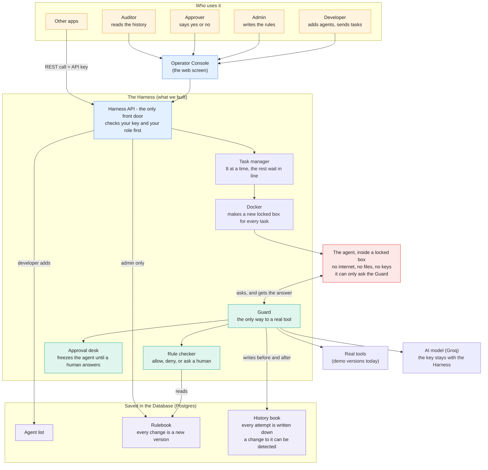
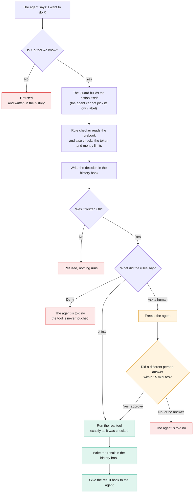

# Architecture

Full reasoning, requirements and threat model: [`docs/DESIGN.md`](docs/DESIGN.md).

## The big picture



| Plain word | Technical name | Where in the code |
|---|---|---|
| Guard | Policy Enforcement Point (the broker) | `src/byoa_harness/broker/broker.py` |
| Rule checker | Policy Decision Point (the policy engine, no I/O) | `src/byoa_harness/policy/engine.py` |
| Rulebook | Policy store (versioned YAML) | `src/byoa_harness/store.py` |
| Locked box | Sandbox (one Docker container per task) | `src/byoa_harness/runtime/sandbox.py` |
| Task manager | Session manager (queue, limits, watchdog) | `src/byoa_harness/runtime/manager.py` |
| Approval desk | Human-in-the-loop approvals | `src/byoa_harness/approvals.py` |
| History book | Audit log (hash-chained, tamper-evident) | `src/byoa_harness/store.py` |
| Harness API | REST API, key check and role check | `src/byoa_harness/api/app.py` |

The four roles are **admin**, **developer**, **approver** and **auditor**. The server checks the role on every request; the
console only mirrors it to grey out buttons. The person who submitted a task can never approve its actions.

## What happens to one action



"8 at a time" and "15 minutes" are the default settings (`MAX_CONCURRENT_SESSIONS`, `APPROVAL_TIMEOUT_S`). The real tools are
in-memory simulators today; a real deployment writes connectors for its own systems.

## Decisions and why

| Decision | Reason | Trade-off |
|---|---|---|
| **Enforcement by capability removal, not by checking.** The sandbox has no network, no mounts, no credentials; its only channel is a pipe to the broker. | An agent cannot "skip" a check on a path that doesn't exist. Reviewers will look for a second door; there isn't one. | Agents cannot use libraries needing network or install packages. |
| **The harness classifies actions.** A tool definition turns raw args into `{type, resource, cost}`; the agent never supplies them. Unknown fields are rejected. | Stops "call the destructive tool but label it a read". | Every capability needs a harness-side connector. |
| **Evaluated == executed.** Canonical `Action` is built once, digest-checked, and the tool receives it (not the raw args). Approvals bind to its digest. | Closes time-of-check/time-of-use and approve-A-run-B. | — |
| **Pure policy engine, default-deny, deny > approval > allow.** Uncertain conditions resolve to the stricter reading. No regex, no code eval. | Order-independent, independently testable, type-confusion can't turn a deny into an allow. | Less expressive than a full language (e.g. Rego). Chosen deliberately for MVP. |
| **Approvals hold the call open and freeze the container** (`docker pause`, excluded from the runtime budget). Timeout, restart, or any error ⇒ deny. | Real pause, not "return an error and hope". | In-memory waiters: approvals do not survive a restart (they expire safely). |
| **Audit written before execution; failure ⇒ deny.** Per-session hash chain + verify endpoint. | Core value proposition; no un-recorded action can happen. | Chain detects tampering/reordering, not deletion of a session's tail without an external anchor. |
| **Policies are immutable versions; sessions pin them.** Only admins author/attach. Session policies can only narrow. | Auditable "which version governed this action"; no self-granting. | A running session doesn't see policy edits. |
| **`docker` CLI + pipe, not the SDK / unix sockets.** | Identical on Linux/macOS/Docker Desktop; the whole isolation flag set is one function. | Process-spawn overhead per session (~0.3 s). |
| **One service + Postgres**, not microservices. | Simplest thing that holds at production scale for this problem. | Session affinity to a replica for now. |

## Deployment and trust boundaries

```
 browser (untrusted) ─▶ nginx :8081 (static console, CSP, same-origin proxy) ─▶ harness :8080 ─▶ Postgres
                                                                              ├─▶ docker-socket-proxy ─▶ Docker ─▶ sandboxes (no network)
                                                                              └─▶ Groq (API key lives only here)
```
Untrusted: the browser and all agent code. Trusted: nginx, harness, Postgres, socket proxy. Authentication is a bearer key
mapped to a name and roles; **authorization is enforced by the harness on every request** (the console only mirrors it
to disable controls). Unauthenticated by design: `/healthz`, `/readyz`, `/metrics`, `/docs`. Review findings, what was
fixed and what still needs a decision: [`docs/ENGINEERING_REVIEW.md`](docs/ENGINEERING_REVIEW.md).

## Where each rubric item lives
Sandbox: `runtime/sandbox.py` + `tests/adversarial/` · Policy: `policy/` + `tests/unit/test_policy_engine.py` ·
BYOA: `runtime/shapes.py`, `docs/BYOA_CONTRACT.md` · Audit: `store.py`, `/v1/audit` · Approvals: `approvals.py` ·
Ops/concurrency: `runtime/manager.py`, `docs/OPERATIONS.md`.
